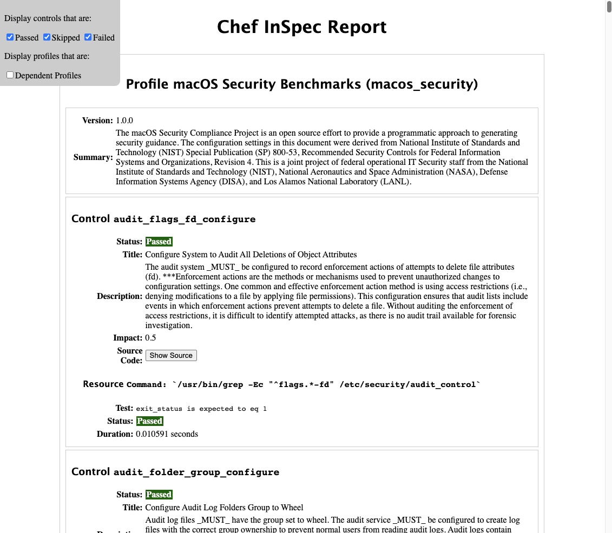

# InSpec Test Generate for macOS Security Project

Aka _"Hello Nisty"_

## macOS Security Project

Is available at [usnistgov/macos_security](https://github.com/usnistgov/macos_security).

> The macOS Security Compliance Project is an open source effort to provide a programmatic approach to generating security guidance. The configuration settings in this document were derived from National Institute of Standards and Technology (NIST) Special Publication (SP) 800-53, Recommended Security Controls for Federal Information Systems and Organizations, Revision 4. This is a joint project of federal operational IT Security staff from the National Institute of Standards and Technology (NIST), National Aeronautics and Space Administration (NASA), Defense Information Systems Agency (DISA), and Los Alamos National Laboratory (LANL).

## Toolings

- Python, generate the Inpsec tests
- [InSpec](https://github.com/InSpec/InSpec), verify, package and ship controls

## Goal of this Project

- quick poc that a InSpec test could be systematically generated from the macOS Security baselines to some degree of accuracy
- account for, or skip any non testable items
- don't apply any additonal logic for the commands, simply wrap and replace the tests and their expected results



## Setup

### Create a InSpec Control Directory within the macOS Security folder

#### Directory Structure

- inpsec-macos_security
  - README.md
  - InSpec.yaml
    - needed for the InSpec profile generation  
  - 👉  controls/
    - here is where the controls will be generated, ok to leave this blank
  - 🐍 place [hello_nisty.py](./hello_nisty.py) in the `scripts` folder within the project

```shell
.
├── CHANGELOG.adoc
├── ...
├── inpsec-macos_security
│   ├── README.md
│   ├── controls 👈
│   │   └── $(tests will be here)
│   └── InSpec.yml
├── ...
├── scripts
│   ├── ...
│   └── hello_nisty.py 🐍
└── ...
```

#### Requirement(s)

[requirements.txt](./requirements.txt)

#### Running the Generator

- run [hello_nisty.py](./hello_nisty.py)
- the script should generate the controls, skipping some items based on tags or checks

```shell
  Processing rule: os_user_app_installation_prohibit
    Tags: ['stig']
    Generated test.
  Processing rule: os_continuous_monitoring
    Tags: ['cnssi-1253', '800-53r4_moderate', '800-53r4_high', 'permanent']
    Skipped test, skip tag.
```

#### Running InSpec

- See the InSpec Profile [README](macos_security/README.md) or more on [InSpec](https://github.com/inspec/inspec)

### Notes

- This was created as a POC and probably won't move much past that.
- The hope was to be able to quickly generate or update InSpec profiles from existing controls.
